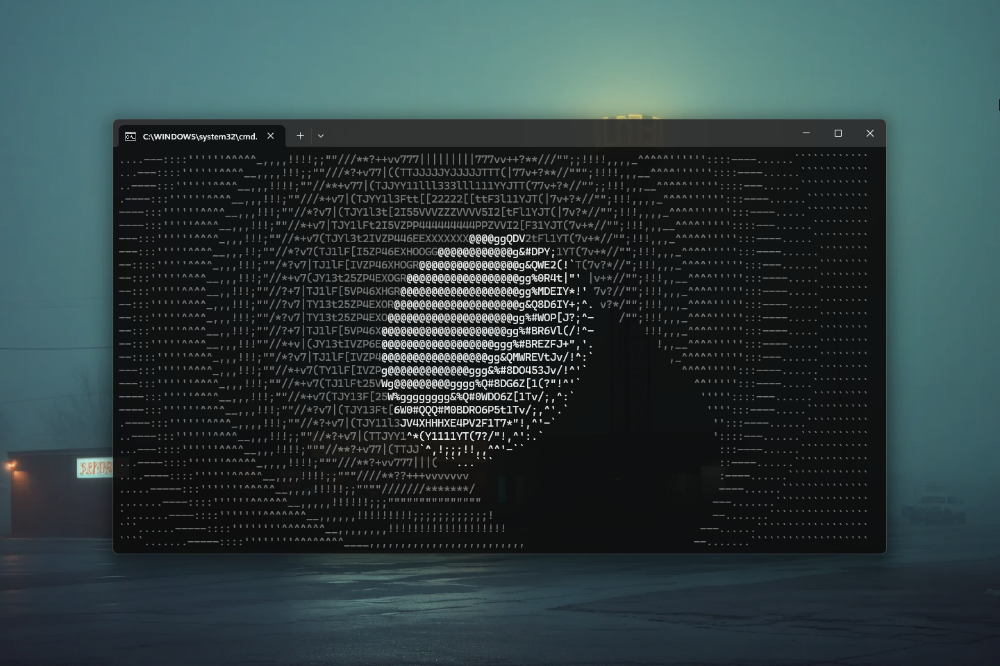

# FastASCII 0.1.1 [ALPHA] — Zero-Allocation ASCII and UTF-8 Byte Engine for Java

[](https://github.com/andrestubbe/FastASCII/releases/tag/0.1.1)
[](https://opensource.org/licenses/MIT)
[](https://www.java.com)
[]()
[](https://jitpack.io/#andrestubbe/FastASCII)

**⚡ A high-performance, zero-allocation byte processing library for Java, engineered for direct manipulation of primitive byte arrays without the devastating overhead of String instantiation or UTF-16 transcoding.**

FastASCII is the foundational byte-level standard library for the **FastJava** ecosystem.

To achieve a completely responsive, zero-latency parsing and rendering experience, FastASCII is the invisible backbone designed to power the rest of the **FastJava** ecosystem:

* ⚡ **[FastANSI](https://github.com/andrestubbe/FastANSI)** — Relies on FastASCII for byte-native escape sequence scanning.
* 🚀 **[FastTerminal](https://github.com/andrestubbe/FastTerminal)** — Uses FastASCII to compose ANSI streams directly to memory for 60+ FPS rendering.
* 🖱️ **[FastMouse](https://github.com/andrestubbe/FastMouse)** — Depends on FastASCII for ultra-fast integer tracking directly from standard input.

[**Watch the Demo**](https://youtu.be/5IxTqipmnOE)

---

[](https://youtu.be/5IxTqipmnOE)

---

```java
// Quick Start — Example

import fastascii.FastASCIIWriter;
import fastascii.FastASCIIReader;

public class Demo {
    public static void main(String[] args) {
        byte[] buffer = new byte[1024];
        
        // Write integers directly to bytes (Zero Allocation!)
        int bytesWritten = FastASCIIWriter.writeInt(buffer, 0, 404);
        
        // Write UTF-8 codepoints natively
        bytesWritten += FastASCIIWriter.writeUtf8(buffer, bytesWritten, 0x1F680); // 🚀

        // Parse unsigned integers blazingly fast
        int parsed = FastASCIIReader.parseUInt(buffer, 0, 3);
        System.out.println("Parsed: " + parsed);
    }
}
```

---

## Table of Contents

- [Why FastASCII?](#why-fastascii)
- [Key Features](#key-features)
- [API Quick Reference](#api-quick-reference)
- [Installation](#installation)
- [License](#license)

---

## Why FastASCII?

The mission is to build the fastest, most robust byte manipulation kernel on the JVM. Java's standard library forces expensive `String` allocations and UTF-8 to UTF-16 conversions that destroy performance in hot loops. FastASCII operates exclusively on primitives, empowering developers to create parsers and renderers that redefine Java performance by pushing the absolute limits of the HotSpot JIT compiler.

---

## Key Features

* **🚫 Zero Allocations** — Bypasses all `String`, `StringBuilder`, and `Matcher` instantiations.
* **⚡ JIT-Optimized Java** — The core layer is pure Java, written specifically to trigger aggressive HotSpot compiler inlining for small buffers (like ANSI codes).
* **🌐 Native UTF-8 Encoding** — Validates, encodes, and decodes UTF-8 codepoints natively at blazing speeds.
* **🎯 Universal Parsers** — Built-in highly-optimized scalar search functions for `indexOf`, whitespace skipping, and integer parsing.

---

## API Quick Reference

| Method                                | Description                                              | Component |
|---------------------------------------|----------------------------------------------------------|-----------|
| `writeInt(buffer, offset, value)`     | Writes an integer directly into a byte buffer.           | `FastASCIIWriter` |
| `writeUtf8(buffer, offset, cp)`       | Encodes a codepoint directly to UTF-8 bytes.             | `FastASCIIWriter` |
| `parseUInt(buffer, start, end)`       | Blazing fast unsigned integer parsing from bytes.        | `FastASCIIReader` |
| `find(haystack, offset, len, needle)` | Zero-allocation `indexOf` replacement.                   | `FastASCIIScanner` |
| `decodeCodePoint(buf, off, len, out)` | High-throughput UTF-8 to UTF-32 decoding.                | `FastUTF8` |

---

## Installation

### Option 1: Maven (Recommended)

Add the JitPack repository and the dependencies to your `pom.xml`:

```xml
<repositories>
    <repository>
        <id>jitpack.io</id>
        <url>https://jitpack.io</url>
    </repository>
</repositories>

<dependencies>
    <!-- FastASCII Library -->
    <dependency>
        <groupId>com.github.andrestubbe</groupId>
        <artifactId>fastascii</artifactId>
        <version>0.1.1</version>
    </dependency>

</dependencies>
```

### Option 2: Gradle (via JitPack)

```groovy
repositories {
    maven { url 'https://jitpack.io' }
}

dependencies {
    implementation 'com.github.andrestubbe:fastascii:0.1.1'
}
```

### Option 3: Direct Download (No Build Tool)

Download the latest JARs directly to add them to your classpath:

1. 📦 **[fastascii-0.1.1.jar](https://github.com/andrestubbe/FastASCII/releases/download/0.1.1/fastascii-0.1.1.jar)** (The Core Library)

---

## License

MIT License — See [LICENSE](LICENSE) file for details.

---

## Related Projects

- [FastTerminal](https://github.com/andrestubbe/FastTerminal)
- [FastANSI](https://github.com/andrestubbe/FastANSI)
- [FastMouse](https://github.com/andrestubbe/FastMouse)
- [FastJSON](https://github.com/andrestubbe/FastJSON)
- [FastFileScrape](https://github.com/andrestubbe/FastFileScrape)
- [FastGLOB](https://github.com/andrestubbe/FastGLOB)
- [FastCore](https://github.com/andrestubbe/FastCore)

---
**Part of the FastJava Ecosystem** — *Making the JVM faster. Small package. Maximum speed. Zero bloat. 🚀💎*
